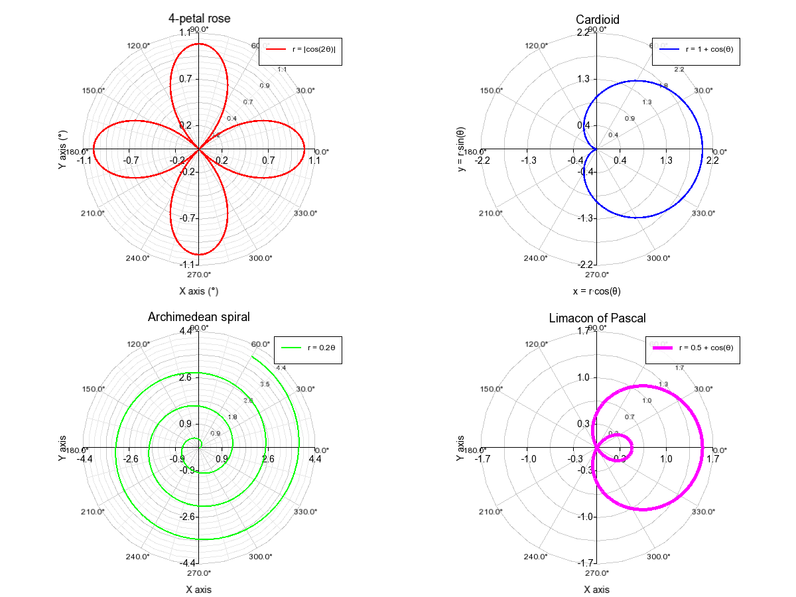

# PlotGenC++

A lightweight C++ library for generating 2D plots and charts using SFML.

## Overview
PlotGenC++ is a C++ library designed for generating 2D plots and charts. It is built on top of the SFML (Simple and Fast Multimedia Library) and provides a simple interface for creating various types of plots, including line plots, histograms, and polar plots. The library is inspired by popular plotting libraries in Python and MATLAB, making it easy to use for those familiar with those environments.

## Features

- Various **2D Charts** with multiple style options
- **Histograms** with customizable bars
- **Polar Plots** for parametric and polar functions
- **Multiple layouts** to display several plots on the same figure
- **Complete customization** of colors, symbols, grids, and legends
- **PNG/JPG export** for integration into documents

## Examples

### Example 1: Basic 2D Plots


### Example 2: Histograms


### Example 3: Polar Plots


### Example 4: Multiple Plots and Customization


### Example 5: Advanced Histograms


### Example 6: Plots with Symbols


## Installation

### Prerequisites

- CMake 3.10 or higher
- C++ compiler with C++17 support
- SFML 2.5 or higher

## Dependencies

- [SFML](https://www.sfml-dev.org/) for graphic rendering
  - Installation: `sudo apt install libsfml-dev`
- [stb_image_write](https://github.com/nothings/stb) for image export (it is included in the repository)
  - Installation: `git clone https://github.com/nothings/stb.git`

### Build and Install

```bash
# Clone the repository
git clone https://github.com/skhelladi/PlotGenCpp.git

# Create a build directory
cd PlotGenCpp
mkdir build && cd build

# Configure and build
cmake ..
make

# Install (optional)
sudo make install
```

## Usage

### Simple Example

```cpp
#include "plotgen.h"
#include <vector>
#include <cmath>

int main() {
    PlotGen plt(800, 600);  // Create an 800x600 window
    
    // Generate data
    std::vector<float> x(100), y(100);
    for (int i = 0; i < 100; ++i) {
        x[i] = i * 0.1f - 5.0f;
        y[i] = std::sin(x[i]);
    }
    
    // Configure and plot
    auto& fig = plt.subplot(0, 0);
    PlotGen::Style style;
    style.color = sf::Color::Blue;
    style.legend = "sin(x)";
    
    plt.set_title(fig, "Sine Wave Plot");
    plt.set_xlabel(fig, "x");
    plt.set_ylabel(fig, "sin(x)");
    plt.set_axis_limits(fig, -5, 5, -1.2, 1.2);
    plt.grid(fig, true, false);
    plt.plot(fig, x, y, style);
    
    // Display and save
    plt.save("sinusoid.png");
    plt.show();
    
    return 0;
}
```

### Running the Examples

Run the example application to see the various available features:

```bash
./build/PlotterExamples
```

## Documentation

Detailed documentation is available in the `docs/` folder.
- [Documentation in English](docs/documentation.md)
- [Documentation in French](docs/documentation_fr.md)

## License

This project is under the GPL-3.0 License. See the [LICENSE](LICENSE) file for details.

## Author

Sofiane KHELLADI

## Contributing

Contributions are welcome! Please feel free to submit a Pull Request.