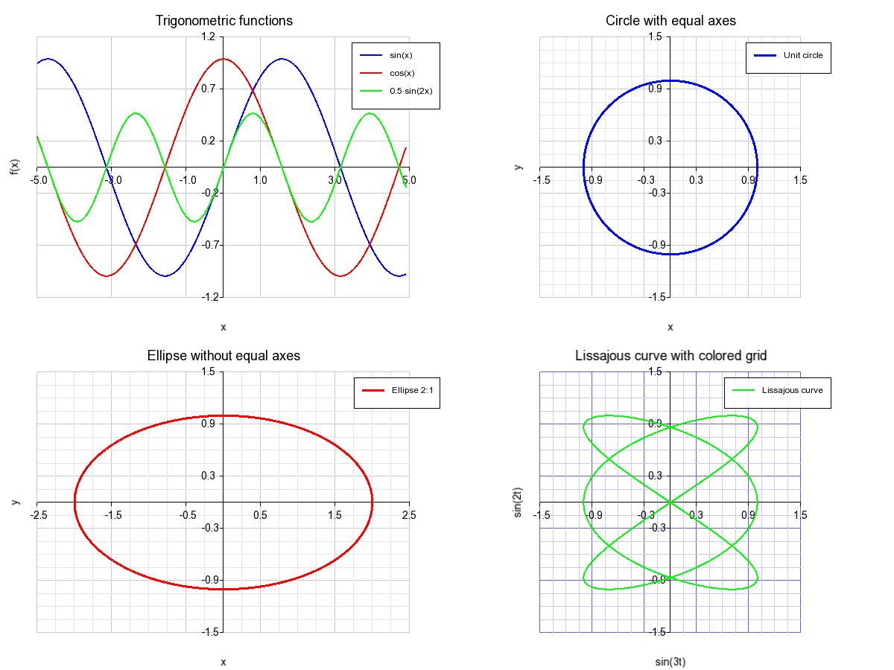

# PlotGenC++ Documentation

- Author: Sofiane KHELLADI
- Date: 21/04/2025
- Version: 1.0
__________________________________

This documentation details the usage of the PlotGenC++ library for generating graphics in C++.

## Table of Contents

1. [Introduction](#introduction)
2. [Installation](#installation)
3. [Basic Concepts](#basic-concepts)
4. [API Reference](#api-reference)
5. [Detailed Examples](#detailed-examples)
6. [Symbols and Styles](#symbols-and-styles)
7. [Advanced Features](#advanced-features)
8. [Tips and Best Practices](#tips-and-best-practices)

## Introduction

PlotGenC++ is a C++ data visualization library inspired by common plotting systems like MATLAB and matplotlib (Python). The library is built on SFML for graphical rendering and offers an intuitive interface for creating high-quality scientific charts.

### Design Goals

- Simple and intuitive interface
- Flexibility and customization
- Publication-ready export quality
- Optimized performance for real-time display

## Installation

### Prerequisites

- C++ compiler with C++17 support
- CMake 3.10 or higher
- SFML 2.5 or higher

### Installation Steps

1. Clone the repository or download the source
2. Configure with CMake:
```bash
mkdir build
cd build
cmake ..
```
3. Compile the project:
```bash
cmake --build .
```
4. Link your project with the PlotGenCpp library and SFML dependencies

## Basic Concepts

### Chart Structure

Each `PlotGen` instance can contain multiple subplots organized in a grid. Here are the essential concepts:

- **Figure**: Main container for all charts
- **Subplot**: An individual chart in the grid
- **Curve**: A series of data plotted on a chart
- **Style**: Defines the visual appearance of a curve

### Typical Workflow

1. Create a `PlotGen` instance
2. Get a reference to a subplot
3. Configure subplot properties
4. Plot data on the subplot
5. Display or save the result

```cpp
// Typical workflow example
PlotGen plt(800, 600);             // Window dimensions
auto& fig = plt.subplot(0, 0);     // Reference to subplot
plt.set_title(fig, "My Chart");    // Configuration
plt.plot(fig, x_data, y_data);     // Plotting
plt.show();                        // Display
```

## API Reference

### PlotGen Class

#### Constructor

```cpp
PlotGen(unsigned int width = 1200, unsigned int height = 900, unsigned int rows = 1, unsigned int cols = 1)
```
- **width**: Window width in pixels
- **height**: Window height in pixels
- **rows**: Number of rows in the subplot grid
- **cols**: Number of columns in the subplot grid

#### Style Structure

```cpp
struct Style {
    sf::Color color;
    float thickness;
    std::string line_style;
    std::string legend;
    std::string symbol_type;
    float symbol_size;
}
```

- **color**: Curve color
- **thickness**: Line thickness
- **line_style**: Line style ("solid", "dashed", "points", "none")
- **legend**: Legend text
- **symbol_type**: Symbol type ("none", "circle", "square", "triangle", "diamond", "star")
- **symbol_size**: Symbol size in pixels

#### Main Methods

##### Subplot Management
```cpp
Figure& subplot(unsigned int row, unsigned int col)
```
Gets a reference to the subplot at position (row, col).

##### Chart Configuration
```cpp
void set_title(Figure& fig, const std::string& title)
void set_xlabel(Figure& fig, const std::string& label)
void set_ylabel(Figure& fig, const std::string& label)
void set_axis_limits(Figure& fig, float xmin, float xmax, float ymin, float ymax)
void set_polar_axis_limits(Figure& fig, float max_radius)
void show_legend(Figure& fig, bool show)
void set_legend_position(Figure& fig, const std::string& position)
void grid(Figure& fig, bool major = true, bool minor = false)
void set_grid_color(Figure& fig, sf::Color major_color, sf::Color minor_color)
void set_equal_axes(Figure& fig, bool equal = true)
```

##### Data Plotting
```cpp
void plot(Figure& fig, const std::vector<float>& x, const std::vector<float>& y, const Style& style = Style())
void hist(Figure& fig, const std::vector<float>& data, int bins = 10, const Style& style = Style(), float bar_width_ratio = 0.9f)
void polar_plot(Figure& fig, const std::vector<float>& theta, const std::vector<float>& r, const Style& style = Style())
void circle(Figure& fig, double x0, double y0, double r, const Style& style = Style())
void text(Figure& fig, double x, double y, const std::string& text_content, const Style& style = Style())
void arrow(Figure& fig, double x1, double y1, double x2, double y2, const Style& style = Style(), double head_size = 10.0)
void line(Figure& fig, double x1, double y1, double x2, double y2, const Style& style = Style())
void arc(Figure& fig, double x0, double y0, double r, double angle1, double angle2, const Style& style = Style(), int num_points = 50)
void bezier(Figure& fig, double x0, double y0, double x1, double y1, double x2, double y2, double x3, double y3, const Style& style = Style(), int num_points = 100)
void bezier(Figure& fig, const std::vector<double>& x, const std::vector<double>& y, const Style& style = Style(), int num_points = 100)
void spline(Figure& fig, const std::vector<double>& x, const std::vector<double>& y, const Style& style = Style(), int num_points = 100)
void cardinal_spline(Figure& fig, const std::vector<double>& x, const std::vector<double>& y, double tension = 0.5, const Style& style = Style(), int num_points = 100)
```

##### Display and Export
```cpp
void show()
void save(const std::string& filename)
```

### Legend Positioning
```cpp
void set_legend_position(Figure& fig, const std::string& position)
```

This function allows you to control where the legend appears on the chart. Available positions are:
- **"top-right"** (default): Positions the legend in the top-right area of the chart
- **"top-left"**: Positions the legend in the top-left area of the chart
- **"bottom-right"**: Positions the legend in the bottom-right area of the chart
- **"bottom-left"**: Positions the legend in the bottom-left area of the chart
- **"outside-right"**: Places the legend outside the chart on the right side

Example:
```cpp
auto& fig = plt.subplot(0, 0);
// Configure and plot...
plt.set_legend_position(fig, "bottom-left");
```

Benefits of the new legend system:
- Automatic sizing based on content
- Visual representation of line styles and symbols within legends
- Flexible positioning for optimal chart layout
- Support for placing legends outside the chart area to avoid overlapping with data

### Optimized Window Management

PlotGenC++ now features improved window management:
- No window is displayed when only using `save()` without `show()`
- Reduced font sizes for titles and legend text for better proportions
- Titles positioned outside the plotting area for cleaner data visualization

### Image Export
```cpp
void save(const std::string& filename)
```
This method allows you to export the chart in PNG or JPG format. Quality and compression options are automatically managed to ensure good image quality. The file format is determined by the extension of the filename:
- Use `.png` for lossless PNG format (best for diagrams and charts with sharp lines)
- Use `.jpg` for compressed JPG format (suitable for images with many color gradients)

Example:
```cpp
plt.save("my_chart.png");  // Save as PNG
plt.save("my_chart.jpg");  // Save as JPG
```

### SVG Vector Export

```cpp
void save_svg(const std::string& filename)
```

This method allows you to export the chart in SVG (Scalable Vector Graphics) format. The SVG format offers several advantages over bitmap formats like PNG or JPG:

- **Perfect scaling**: SVG graphics can be scaled to any size without quality loss
- **Reduced file size** for charts that primarily consist of lines and geometric shapes
- **Further editing**: SVG files can be modified with vector editors like Inkscape or Adobe Illustrator
- **Document integration**: Ideal for integration into scientific papers and presentations
- **Web compatibility**: SVG files can be directly embedded into web pages

Graphics exported in SVG include all the visual features of the raster version:
- Polar and Cartesian grids with enhanced annotations (decimal values)
- Curves, symbols, and legends
- Text and annotations
- Geometric shapes and arrows

Usage example:
```cpp
// After creating your chart
plt.save_svg("my_chart.svg");
```

#### Example SVG Output


The example above shows a chart exported in SVG with the `save_svg()` function. Note the sharpness of the lines and text, as well as the quality preserved at any display scale.

### Interactive Display
```cpp
void show()
```
This method opens an interactive window to visualize the chart. It handles window events, allowing you to close the window when you're done viewing the chart. The window remains open until it is closed by the user, either by clicking the close button or pressing the Escape key.

Example:
```cpp
plt.show();  // Display the chart in an interactive window
```

## Detailed Examples

### Example 1: Basic 2D Plots


This example shows how to create simple 2D plots with different mathematical functions:
- Sine function
- Parabolic function
- Exponential and logarithmic functions
- Different line styles

Key points:
- 2x2 grid organization
- Axis limit customization
- Grid and legend usage
- Various line styles

### Example 2: Histograms


This example illustrates creating histograms with different distributions:
- Normal distribution with different bin counts
- Uniform distribution
- Exponential distribution

Key points:
- Control of bin count
- Automatic axis limit detection
- Color customization

### Example 3: Polar Plots


This example presents plots in polar coordinates:
- 4-petal rose
- Cardioid
- Archimedes' spiral
- Pascal's Limaçon

Key points:
- Automatic conversion between polar and Cartesian coordinates
- Polar grids with enhanced annotations (values displayed with decimal precision)
- Equal scale axes to preserve shape

### Example 4: Multiple Plots and Customization



This example shows advanced customization features:
- Multiple curves on the same chart
- Equal scale axes for circles
- Grid color customization

Key points:
- Overlaying multiple curves
- Equal axis options
- Grid and color customization

### Example 5: Advanced Histograms


This example presents advanced techniques for histograms:
- Bimodal distribution with thin and wide bars
- Comparison of distributions on the same chart
- Histograms with color gradients

Key points:
- Control of bar width
- Histogram overlay
- Data division by ranges

### Example 6: Plots with Symbols


This example illustrates the use of symbols:
- Different symbol types
- Various symbol sizes
- Combination of lines and symbols

Key points:
- Control of symbol types
- Size customization
- Combination of visualization styles

### Example 7: Circles, Text and Arrows


This example demonstrates the use of geometric annotations and shapes:
- Drawing perfect circles with different styles
- Adding explanatory text at specific positions
- Using arrows to indicate important features
- Combining lines and arcs for geometric constructions

Key points:
- Creation of precise geometric objects
- Clear and readable annotations
- Harmonious integration of different elements
- Effective use of visual styles

### Example 8: Bezier and Spline Curves


This example illustrates different methods of curve interpolation:
- Cubic Bezier curves controlled by points
- Natural splines passing through data points
- Cardinal splines with different tension values
- Comparison of different interpolation techniques

Key points:
- Understanding the differences between curve types
- Precise shape control with Bezier curves
- Natural interpolation with cubic splines
- Tension adjustments for cardinal splines
- Visualization of control points and resulting curves

## Symbols and Styles

### Available Symbol Types
- **circle**: Circle
- **square**: Square
- **triangle**: Triangle
- **diamond**: Diamond
- **star**: Star
- **none**: No symbol

### Line Styles
- **solid**: Continuous line
- **dashed**: Dotted line
- **points**: Points only
- **none**: No line (useful for displaying only symbols)

### Predefined Colors
- `sf::Color::Red`
- `sf::Color::Green`
- `sf::Color::Blue`
- `sf::Color::Yellow`
- `sf::Color::Magenta`
- `sf::Color::Cyan`
- `sf::Color::White`
- `sf::Color::Black`

Custom color: `sf::Color(r, g, b)` with r, g, b between 0 and 255.

## Advanced Features

### Custom Grids
```cpp
void grid(Figure& fig, bool major, bool minor)
void set_grid_color(Figure& fig, sf::Color major_color, sf::Color minor_color)
```

The library allows customization of grid display with:
- Major and minor grid lines
- Customizable colors
- Automatic adaptation to polar coordinates

### Equal Axis Scale
```cpp
void set_equal_axes(Figure& fig, bool equal)
```

This feature ensures that units on the X and Y axes are identical, which is essential for:
- Preserving the shape of circles
- Correctly visualizing geometric objects
- Producing accurate polar plots

### Multiline Legends

Legends are automatically wrapped if they exceed a certain width, which allows:
- Displaying detailed descriptions
- Maintaining readability of long legends
- Including Unicode symbols in legends

### Circle Drawing
```cpp
void circle(Figure& fig, double x0, double y0, double r, const Style& style = Style())
```

This function allows you to draw a perfect circle on a plot by specifying its center coordinates and radius:
- **x0, y0**: The coordinates of the circle's center
- **r**: The radius of the circle
- **style**: The visual style of the circle (color, thickness, etc.)

The function automatically:
- Ensures the circle appears perfectly round (by temporarily enabling equal axes if needed)
- Adjusts axis limits to properly display the circle if necessary
- Applies the specified style to the circle's outline

Example:
```cpp
auto& fig = plt.subplot(0, 0);
plt.set_title(fig, "Circle Example");
plt.grid(fig, true, false);

// Draw a red circle with center at (0,0) and radius 5
PlotGen::Style circle_style;
circle_style.color = sf::Color::Red;
circle_style.thickness = 2.0;
circle_style.legend = "Circle (0,0) r=5";
plt.circle(fig, 0, 0, 5, circle_style);

plt.show();
```

### Lines, Arcs and Arrows
```cpp
void line(Figure& fig, double x1, double y1, double x2, double y2, const Style& style = Style())
void arc(Figure& fig, double x0, double y0, double r, double angle1, double angle2, const Style& style = Style(), int num_points = 50)
void arrow(Figure& fig, double x1, double y1, double x2, double y2, const Style& style = Style(), double head_size = 10.0)
```

These functions allow you to add geometric annotations to your plots:

#### Line
```cpp
void line(Figure& fig, double x1, double y1, double x2, double y2, const Style& style = Style())
```

Draws a straight line between two points:
- **(x1,y1)**: Starting point
- **(x2,y2)**: Ending point
- **style**: Visual style of the line

Lines are useful for:
- Creating custom grid lines
- Adding reference lines to highlight thresholds
- Drawing geometric shapes in combination with other primitives

Example:
```cpp
auto& fig = plt.subplot(0, 0);
plt.set_title(fig, "Line Example");
plt.grid(fig, true, false);
plt.set_axis_limits(fig, -5, 5, -5, 5);

// Draw diagonal lines with different styles
PlotGen::Style dash_style;
dash_style.color = sf::Color::Red;
dash_style.thickness = 2.0;
dash_style.line_style = "dashed";
dash_style.legend = "Dashed Line";
plt.line(fig, -4, -4, 4, 4, dash_style);

PlotGen::Style solid_style;
solid_style.color = sf::Color::Blue;
solid_style.thickness = 3.0;
solid_style.legend = "Solid Line";
plt.line(fig, -4, 4, 4, -4, solid_style);

plt.show();
```

#### Arc
```cpp
void arc(Figure& fig, double x0, double y0, double r, double angle1, double angle2, const Style& style = Style(), int num_points = 50)
```

Draws an arc (partial circle) centered at a specific point:
- **(x0,y0)**: Center of the arc
- **r**: Radius of the arc
- **angle1**: Starting angle in degrees (0 = right, 90 = up)
- **angle2**: Ending angle in degrees
- **style**: Visual style of the arc
- **num_points**: Number of points to generate for the arc (higher = smoother)

Arcs are useful for:
- Creating circular sectors
- Drawing angle indicators
- Building complex shapes from geometric primitives

Example:
```cpp
auto& fig = plt.subplot(0, 0);
plt.set_title(fig, "Arc Example");
plt.grid(fig, true, false);
plt.set_axis_limits(fig, -6, 6, -6, 6);
plt.set_equal_axes(fig, true);

// Draw a complete circle first
PlotGen::Style circle_style;
circle_style.color = sf::Color(200, 200, 200);  // Light gray
circle_style.thickness = 1.0;
plt.circle(fig, 0, 0, 5.0, circle_style);

// Draw several arcs around the circle
PlotGen::Style arc1_style;
arc1_style.color = sf::Color::Red;
arc1_style.thickness = 3.0;
arc1_style.legend = "0° to 90°";
plt.arc(fig, 0, 0, 5.0, 0, 90, arc1_style);

PlotGen::Style arc2_style;
arc2_style.color = sf::Color::Blue;
arc2_style.thickness = 3.0;
arc2_style.legend = "90° to 180°";
plt.arc(fig, 0, 0, 5.0, 90, 180, arc2_style);

PlotGen::Style arc3_style;
arc3_style.color = sf::Color::Green;
arc3_style.thickness = 3.0;
arc3_style.legend = "180° to 270°";
plt.arc(fig, 0, 0, 5.0, 180, 270, arc3_style);

PlotGen::Style arc4_style;
arc4_style.color = sf::Color::Yellow;
arc4_style.thickness = 3.0;
arc4_style.legend = "270° to 360°";
plt.arc(fig, 0, 0, 5.0, 270, 360, arc4_style);

plt.show();
```

#### Arrow
```cpp
void arrow(Figure& fig, double x1, double y1, double x2, double y2, const Style& style = Style(), double head_size = 10.0)
```

Draws an arrow from one point to another:
- **(x1,y1)**: Starting point (tail of the arrow)
- **(x2,y2)**: Ending point (where the arrowhead points)
- **style**: Visual style of the arrow
- **head_size**: Size of the arrowhead in pixels

Arrows are useful for:
- Indicating direction or flow
- Highlighting specific features on a plot
- Creating vector field visualizations
- Adding annotations with directional emphasis

Example:
```cpp
auto& fig = plt.subplot(0, 0);
plt.set_title(fig, "Arrow Example");
plt.grid(fig, true, false);
plt.set_axis_limits(fig, -5, 5, -5, 5);

// Draw arrows with different styles and head sizes
PlotGen::Style arrow1_style;
arrow1_style.color = sf::Color::Red;
arrow1_style.thickness = 2.0;
arrow1_style.legend = "Standard Arrow";
plt.arrow(fig, -3, -3, 3, 3, arrow1_style, 10.0);

PlotGen::Style arrow2_style;
arrow2_style.color = sf::Color::Blue;
arrow2_style.thickness = 3.0;
arrow2_style.legend = "Large Arrowhead";
plt.arrow(fig, 3, -3, -3, 3, arrow2_style, 20.0);

// Add text labels
PlotGen::Style text_style;
text_style.color = sf::Color::Green;
plt.text(fig, 3.2, 3.2, "Destination", text_style);
plt.text(fig, -3.2, -3.2, "Origin", text_style);

plt.show();
```

### Text Annotations
```cpp
void text(Figure& fig, double x, double y, const std::string& text_content, const Style& style = Style())
```

This function allows you to add text labels or annotations at specific coordinates on your plot:
- **x, y**: The position where the text should be placed
- **text_content**: The text to display
- **style**: The visual style of the text (color, size, etc.)

Text annotations are useful for:
- Labeling specific data points
- Adding explanations directly on the chart
- Marking important features or regions
- Including mathematical formulas or equations

The text size can be controlled using the `thickness` property in the style:
- Higher thickness values create larger text
- Default value produces readable text that matches the chart's scale

Example:
```cpp
auto& fig = plt.subplot(0, 0);
// Plot data...

// Add text annotation at position (2, 3)
PlotGen::Style text_style;
text_style.color = sf::Color::Blue;
text_style.thickness = 3.0;  // Larger text
plt.text(fig, 2, 3, "Maximum value", text_style);

// Add another text with default size
plt.text(fig, 4, 1, "Inflection point", PlotGen::Style(sf::Color::Red));

plt.show();
```

### Bézier Curves
```cpp
void bezier(Figure& fig, double x0, double y0, double x1, double y1, 
            double x2, double y2, double x3, double y3, 
            const Style& style = Style(), int num_points = 100)

void bezier(Figure& fig, const std::vector<double>& x, const std::vector<double>& y, 
            const Style& style = Style(), int num_points = 100)
```

These functions allow you to create smooth Bézier curves on your plots:

1. The first version creates a cubic Bézier curve using four control points:
   - **(x0,y0)**: The starting point
   - **(x1,y1)** and **(x2,y2)**: The intermediate control points that influence the curve's shape
   - **(x3,y3)**: The ending point
   
2. The second version allows for Bézier curves of any degree by providing vectors of control points:
   - The curve will pass through the first and last points
   - The intermediate points act as control points to shape the curve
   - The number of control points determines the degree of the curve

The `num_points` parameter controls the smoothness of the rendered curve (more points = smoother curve).

Bézier curves are useful for:
- Creating smooth interpolations between data points
- Designing custom curve shapes with precise control
- Visualizing parametric designs or animations paths
- Creating aesthetically pleasing illustrations

Example of cubic Bézier curve:
```cpp
auto& fig = plt.subplot(0, 0);
plt.set_title(fig, "Cubic Bézier Curve");
plt.grid(fig, true, false);
plt.set_axis_limits(fig, -2, 6, -2, 6);

// Create a cubic Bézier curve from (0,0) to (5,0) with control points at (2,4) and (3,4)
PlotGen::Style bezier_style;
bezier_style.color = sf::Color::Red;
bezier_style.thickness = 3.0;
bezier_style.legend = "Cubic Bézier";
plt.bezier(fig, 0, 0, 2, 4, 3, 4, 5, 0, bezier_style);

// Draw the control points
PlotGen::Style control_style;
control_style.color = sf::Color::Blue;
control_style.symbol_type = "circle";
control_style.symbol_size = 8.0;
control_style.line_style = "none";
control_style.legend = "Control Points";

std::vector<double> ctrl_x = {0, 2, 3, 5};
std::vector<double> ctrl_y = {0, 4, 4, 0};
plt.plot(fig, ctrl_x, ctrl_y, control_style);

plt.show();
```

### Splines
```cpp
void spline(Figure& fig, const std::vector<double>& x, const std::vector<double>& y, 
           const Style& style = Style(), int num_points = 100)

void cardinal_spline(Figure& fig, const std::vector<double>& x, const std::vector<double>& y, 
                    double tension = 0.5, const Style& style = Style(), int num_points = 100)
```

PlotGenC++ provides two types of splines for creating smooth curves through a set of points:

1. **Natural Cubic Spline** (`spline`): 
   - Creates a smooth curve that passes through all given points
   - Uses natural boundary conditions (second derivative is zero at endpoints)
   - Produces a curve with continuous second derivatives (C² continuity)
   
2. **Cardinal Spline** (`cardinal_spline`):
   - Creates a smoother curve that passes through all given points
   - The `tension` parameter controls how tightly the curve follows the control points:
     - `tension = 0`: Maximum smoothness (Catmull-Rom spline)
     - `tension = 1`: Tighter curves (less smooth but closer to control points)
   - Ideal for visualization where preserving the shape of data is important

The `num_points` parameter controls the resolution of the rendered curve.

Splines are excellent for:
- Smoothly interpolating between data points for visualization
- Creating natural-looking curves for scientific data
- Generating smooth trajectories for animations
- Approximating functions from sampled data

Example of using splines:
```cpp
auto& fig = plt.subplot(0, 0);
plt.set_title(fig, "Comparison of Spline Types");
plt.grid(fig, true, false);
plt.set_axis_limits(fig, -1, 11, -2, 8);

// Create some irregular data points
std::vector<double> x = {0, 2, 3, 5, 7, 9, 10};
std::vector<double> y = {0, 1, 5, 3, 6, 4, 2};

// Original data points
PlotGen::Style points_style;
points_style.color = sf::Color::Blue;
points_style.symbol_type = "circle";
points_style.symbol_size = 8.0;
points_style.line_style = "none";
points_style.legend = "Data Points";
plt.plot(fig, x, y, points_style);

// Natural cubic spline
PlotGen::Style spline_style;
spline_style.color = sf::Color::Red;
spline_style.thickness = 2.0;
spline_style.legend = "Natural Cubic Spline";
plt.spline(fig, x, y, spline_style);

// Cardinal spline with tension = 0.5
PlotGen::Style cardinal_style;
cardinal_style.color = sf::Color::Green;
cardinal_style.thickness = 2.0;
cardinal_style.line_style = "dashed";
cardinal_style.legend = "Cardinal Spline (tension=0.5)";
plt.cardinal_spline(fig, x, y, 0.5, cardinal_style);

// Cardinal spline with tension = 0.0 (Catmull-Rom)
PlotGen::Style catmull_style;
catmull_style.color = sf::Color::Magenta;
catmull_style.thickness = 2.0;
catmull_style.line_style = "dashed";
catmull_style.legend = "Catmull-Rom Spline (tension=0.0)";
plt.cardinal_spline(fig, x, y, 0.0, catmull_style);

plt.set_legend_position(fig, "outside-right");
plt.show();
```

## Tips and Best Practices

### Performance Optimization
- Limit the number of points for complex plots
- Use symbols judiciously (they are expensive to display)
- Prefer PNG export for best quality

### Troubleshooting Common Problems
- If fonts don't load correctly, verify that the arial.ttf file is in the correct location
- For Linux systems, the library automatically searches for system fonts if arial.ttf is not found

### Tips for Beautiful Charts
- Use contrasting colors for different curves
- Enable grids to improve readability
- Adapt axis limits to the data rather than using default values
- Prefer different line styles when colors are similar
- Use symbols for important points